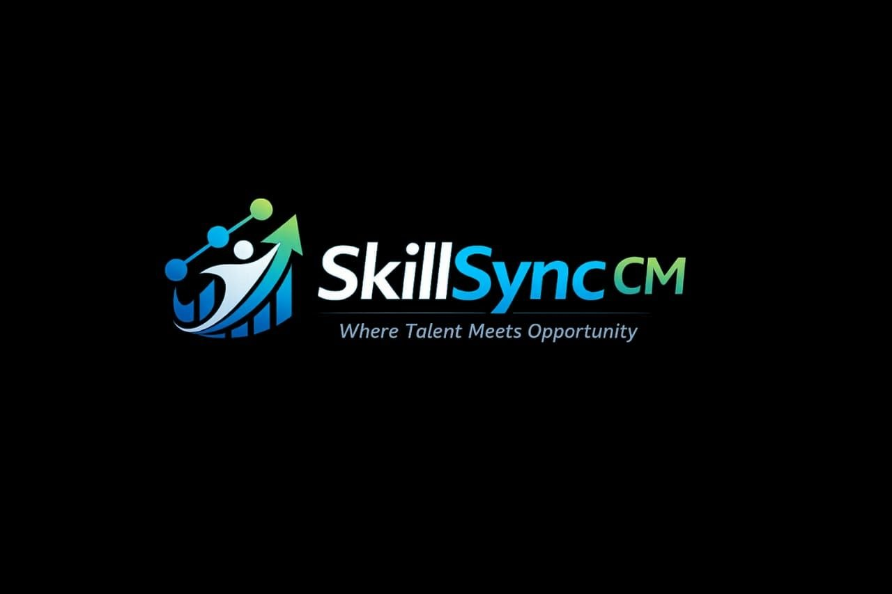

# SkillSync CM

## Where Talent Meets Opportunity

An AI-Powered Labor Market Intelligence Platform for Cameroon, built to bridge the gap between talent and opportunity.



---

## Overview

SkillSync CM is a comprehensive web platform that helps Cameroonian job seekers make data-driven career decisions while connecting employers with qualified talent.

### The Problem
- 80%+ youth unemployment in Cameroon
- Critical mismatch between graduate skills and employer needs
- 75% of CVs rejected by ATS systems before reaching humans
- No centralized labor market intelligence platform in Cameroon

### Our Solution
SkillSync CM provides:
- **Real-time market intelligence** from actual job postings
- **AI-powered career guidance** through an intelligent chat assistant
- **Skill gap analysis** to identify what's missing for target roles
- **CV optimization** with ATS compatibility scoring
- **Job listings** where companies post and candidates apply

---

## Features

### 1. Market Intelligence Dashboard
- Top in-demand skills in Cameroon
- Salary ranges by role
- Hiring trends across industries
- Top hiring companies
- Job distribution by city

### 2. AI Chat Assistant
- Powered by DeepSeek AI
- Multiple model options (V3, R1, Coder, V2.5)
- Personality customization
- Career advice and guidance

### 3. Skill Gap Analyzer
- 100+ skills database
- 25+ job roles
- Interactive radar charts
- Personalized learning roadmap

### 4. Smart CV Analyzer
- ATS compatibility scoring
- Keyword matching
- Missing skills detection
- Improvement recommendations

### 5. Job Listings
- Browse by category and location
- Search functionality
- Detailed job views
- Post a job (for employers)

### 6. Email Notifications
- Subscribe for job alerts
- Automatic notifications on new postings
- Firebase for subscriber management
- EmailJS for email delivery

---

## Technology Stack

### Backend
- Python 3.10+
- Flask
- Flask-CORS
- PyCryptodome
- Requests

### AI Integration
- DeepSeek AI API
- Multiple model support

### Frontend
- HTML5 / CSS3
- JavaScript (Vanilla)
- Tailwind CSS
- Chart.js
- Font Awesome

### Services
- Firebase Firestore (Subscribers)
- EmailJS (Email Notifications)

---

## Installation

### Prerequisites
- Python 3.10 or higher
- pip
- Modern web browser

### Steps

1. **Clone the repository**
```bash
git clone https://github.com/YOUR_USERNAME/skillsync-cm.git
cd skillsync-cm